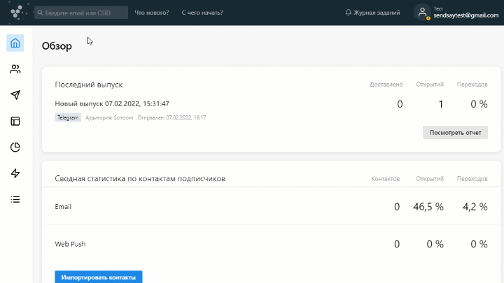
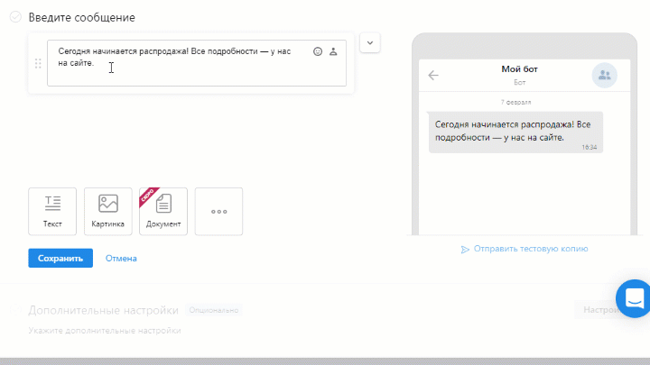

import campaignEditor from "./assets/how-to-create-a-telegram-campaign/telegram-campaign-editor.png";

# Как отправить рассылку в Телеграме

Рассылка в Телеграме — это сообщение, отправленное через бота. Чтобы отправить рассылку в Телеграме, нужно сначала подключить бота к Sendsay.

[Как подключить бот в Телеграме](./how-to-connect-a-bot.md)

Чтобы создать выпуск, откройте раздел **Рассылки → Черновики**, нажмите на плюсик и выберите тип «Telegram».

  

Также вы можете создать шаблон в разделе **Контент → Telegram**, по нему можно отправлять обычные выпуски или рассылки с помощью автоматизаций.

Подготовка рассылки к отправке проходит в пять шагов:

## 1. Выберите аудиторию
Выпуск можно отправить подписчикам одного бота.

## 2. Настройте содержимое
Рассылка в Телеграме состоит из текста и картинок. Каждая картинка придёт как отдельное сообщение, текст выпуска также можно разбить на несколько сообщений. Рассылку можно персонализировать — например, обратиться к читателям по имени (у подписчиков импортируются имя и фамилия, если они указаны). Для этого нужно нажать на иконку человечка рядом с текстом сообщения и выбрать, какие данные подписчика вы хотите добавить.

    

Чтобы отформатировать текст или привязать к нему ссылку, выделите нужный фрагмент в сообщении — над ним появятся настройки. Клики по ссылкам будут учитываться в статистике только в том случае, если ссылки вшиты в текст и начинаются с http или https (переходы по адресам, которые вставлены в сообщение текстом, не считаются).

  

## 3. Отправьте себе тестовую копию (опционально)
Перед выпуском можно отправить тестовую копию на свой аккаунт, чтобы посмотреть, как выглядит сообщение целиком. Тестовые копии можно отправлять только подписчикам бота, при отправке нужно указать ID подписчика (а не ник) — его можно найти в списке подписчиков телеграм-бота.

## 4. Подключите дополнительные настройки (опционально)
### Отслеживание кликов в Google Analytics и Яндекс.Метрике
Клики отслеживаются с помощью UTM-меток — они нужны для анализа поведения подписчиков, карты кликов и эффективности рассылки в Google Analytics и Яндекс.Метрике.

[Как добавить UTM-метки в письмо](/docs/email-campaigns/settings/how-to-add-utm.md)

### Передача дополнительных данных
Передача дополнительных данных нужна для персонализации веб-страниц для подписчика.

## 5. Выберите способ отправки
Есть четыре способа:

**Отправить сразу.**

**Запланировать выпуск** (до отправки выпуски хранятся в папке «Запланированные», где их можно редактировать).

**Оптимизировать время выпуска** — выпуск отправляется каждому подписчику в то время, когда он с наибольшей вероятностью откроет уведомление (это определяет алгоритм). Способ эффективен после месяца активных рассылок: сначала нужно отправить несколько выпусков, чтобы накопить статистику по открытиям.

:::tip Важно
Функция оптимизации времени подключается отдельно — чтобы активировать её в аккаунте, напишите нам в чат
:::

**Отправлять выпуск по частям** — выпуск отправляется небольшими пачками через одинаковые интервалы времени. Это поможет распределить нагрузку на колл-центр.